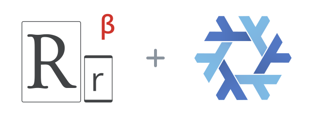

<p align="center">
  
</p>

<h1 align="center">responsively-flake</h1>

<p align="center">
  <a href="flake.nix"></a>
  <a href="LICENSE"></a>
  <a href="https://kernel.org"></a>
</p>

[Responsively App](https://responsively.app) previews a website at several device sizes, with navigation and interactions mirrored between them.

This flake builds the Electron desktop app from the upstream source instead of wrapping a prebuilt AppImage. Install the package in a NixOS or Home Manager configuration, or try it directly:

```sh
nix run github:Fractal-Tess/responsively-flake
nix build github:Fractal-Tess/responsively-flake
```

The package includes the desktop launcher, `.desktop` entry, icon, and MCP tools.

## Install in a consumer configuration

Add the input to your flake:

```nix
inputs.responsively-flake.url = "github:Fractal-Tess/responsively-flake";
```

Use the NixOS or Home Manager module:

```nix
# NixOS
{
  imports = [ inputs.responsively-flake.nixosModules.default ];
  programs.responsively.enable = true;
}

# Home Manager
{
  imports = [ inputs.responsively-flake.homeManagerModules.default ];
  programs.responsively.enable = true;
}
```

The module defaults to the flake's canonical `responsively` package. To select
a package explicitly, set `programs.responsively.package`, for example
`inputs.responsively-flake.packages.${pkgs.system}.responsively`.


## MCP

Responsively's built-in HTTP MCP server is local-only by default at `http://127.0.0.1:12720/mcp`. The stdio launcher starts the desktop app on demand, so an MCP client can use:

```sh
nix run github:Fractal-Tess/responsively-flake#mcp
```

For OMP, add this server to `mcpServers` in `~/.omp/agent/mcp.json`:

```json
"responsively": {
  "type": "stdio",
  "command": "nix",
  "args": ["run", "github:Fractal-Tess/responsively-flake#mcp"],
  "timeout": 90000
}
```

Auto-launch requires a graphical session. The app's HTTP MCP endpoint stays on loopback; no proxy or network exposure is needed.

## Update

The daily [update workflow](.github/workflows/update.yml) advances the locked upstream source, refreshes changed dependency hashes, and commits only after the package passes its flake check. Run the same process locally with:

```sh
./scripts/update.sh
```

## Credits and mirrors

[GitHub](https://github.com/Fractal-Tess/responsively-flake) · Gitadel: `ssh://git@neo.netbird.cloud:2222/fractal-tess/responsively-flake.git`

Flake code is [MIT](LICENSE). The package retains upstream's root AGPL-3.0 and desktop MIT notices, including Electron React Boilerplate's attribution.

Logo combines the [Responsively icon](https://github.com/responsively-org/responsively-app/blob/main/desktop-app/assets/icon.svg) and [Nix snowflake](https://github.com/NixOS/nixos-artwork/tree/master/logo) by Simon Frankau and Tim Cuthbertson ([CC BY 4.0](https://creativecommons.org/licenses/by/4.0/)), resized and arranged here.
